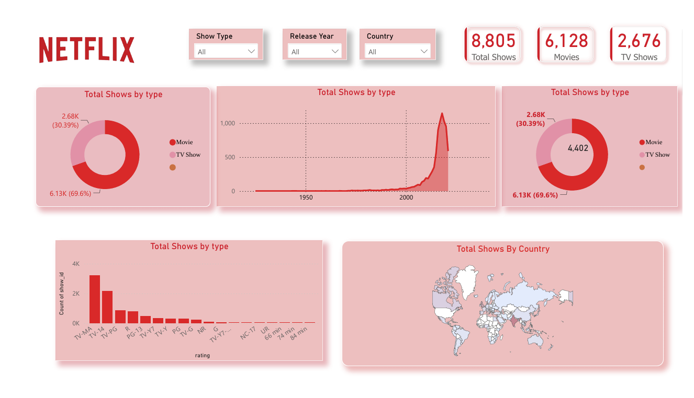

# Netflix Data Analysis Dashboard

An interactive **Netflix Data Analysis Dashboard** built using **Microsoft Power BI**.  
The dashboard provides an overview of Netflix movies and TV shows, with filters for show type, release year, and country.

## 📊 Dashboard Preview
)

## 🔍 Dashboard Features

- Total number of Netflix shows
- Movie vs. TV Show distribution
- Release year analysis
- Country-wise content distribution
- Rating-wise content analysis
- Interactive filters for:
  - Show Type
  - Release Year
  - Country

## 📈 Key Metrics

| Metric | Value |
|---|---:|
| Total Shows | 8,805 |
| Movies | 6,128 |
| TV Shows | 2,676 |

## 🛠️ Tools & Technologies

- **Microsoft Power BI**
- **Power Query**
- **DAX**
- **CSV Dataset**
- **Data Visualization**

## 📁 Project Files

- `Netflix_Dashboard.pbix` — Power BI dashboard file
- `netflix_titles (1).csv` — Netflix dataset
- `Country.json` — Country-related data
- `Copy of Country.json` — Supporting data file
- `Copy of Copy of Country.json` — Supporting data file
- `Netflix Logo.png` — Dashboard asset
- `dashboard-preview.png` — Dashboard preview image

## 🚀 How to Use

1. Download or clone this repository.
2. Open `Netflix_Dashboard.pbix` using **Microsoft Power BI Desktop**.
3. Make sure the dataset paths are correctly configured if Power BI asks for them.
4. Refresh the data if required.
5. Explore the dashboard using the available filters and visualizations.

## 💡 Project Objective

The objective of this project is to analyze Netflix's content library and present meaningful insights through an interactive Power BI dashboard.

## 👤 Author

**Tanuj Sanwal**
